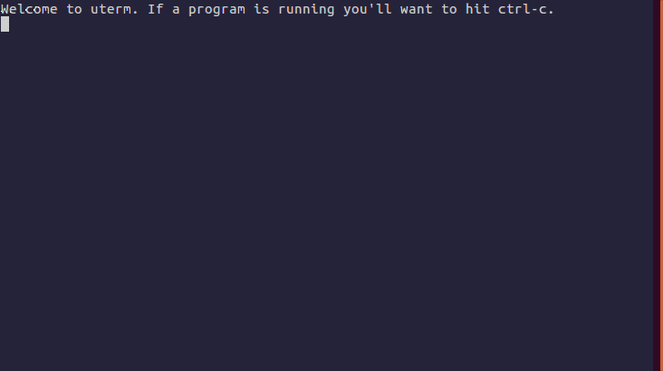

=====
uterm
=====

A micropython-friendly terminal.

Just run ``uterm`` to start.

Bring up a menu with ``esc`` where you can:

- upload files
- browse remote files (``del`` to delete)

Quit from the menu or ``ctrl-a``, ``ctrl-q``.

